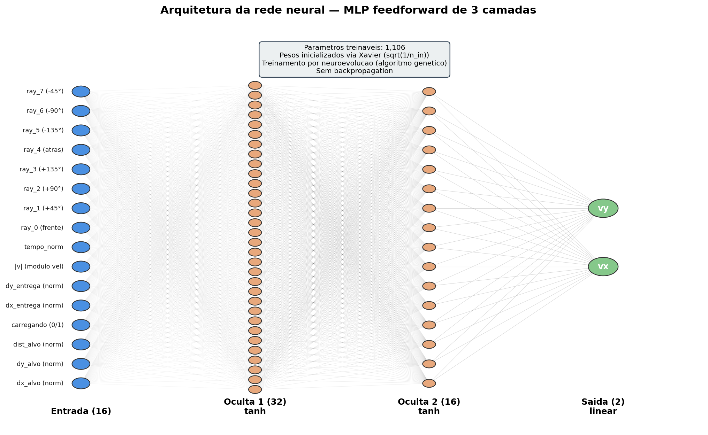
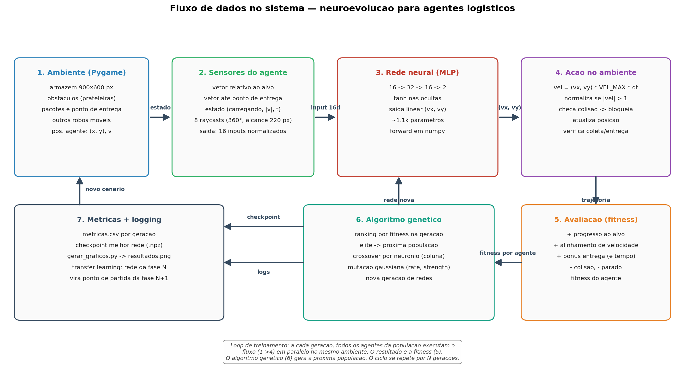
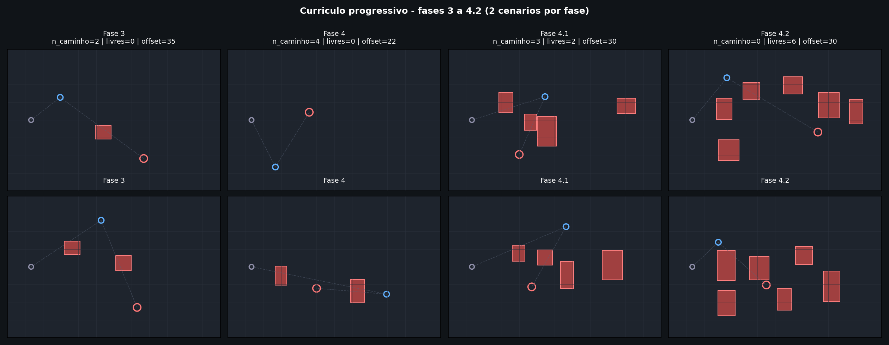

# Neuroevolução aplicada à simulação de multiagentes em ambientes logísticos

> Trabalho de Conclusão de Curso — Ciência da Computação
> Centro Universitário do Instituto Mauá de Tecnologia (IMT)

**Autores:** Arthur Baptista Falzetta, Enrico Orlando Bernardi de Oliveira, Lucas Ribeiro Giaquinto, Matheus Nogami Weber, Murilo Sucupira Sacchi
**Orientação:** Prof. Milkes Yone Alvarenga

---

## Resumo

Treinamos uma rede neural artificial (MLP feedforward) para controlar robôs móveis autônomos em um armazém simulado, usando **neuroevolução** (algoritmo genético, sem retropropagação). O treinamento segue um **currículo progressivo** de 5 fases, cada uma adicionando uma dimensão nova de dificuldade — desde navegação livre até coordenação descentralizada com obstáculos e robôs móveis compartilhando o ambiente. Cada fase aproveita o melhor controlador da anterior (*transfer learning*), acelerando o aprendizado.

---

## 1. Como funciona a rede

**Tipo:** MLP (Multi-Layer Perceptron) feedforward totalmente conectada, com 3 camadas (2 ocultas + saída). Optamos por uma arquitetura densa e compacta porque o estado do agente é um vetor numérico de baixa dimensionalidade — não uma imagem — o que torna desnecessárias arquiteturas convolucionais (CNN, ResNet) ou recorrentes.



| Camada | Neurônios | Ativação |
|---|---|---|
| Entrada | 16 | — |
| Oculta 1 | 32 | tanh |
| Oculta 2 | 16 | tanh |
| Saída | 2 | **linear** (sem ativação) |

**Total de parâmetros:** ~1 100. **Inicialização:** Xavier (gaussiana escalonada por √(1/n_in)).

### Por que a saída é linear?

Inicialmente a saída usava `tanh` também — o que **saturava** os outputs em ±1 e forçava o agente a se mover apenas em 4 diagonais fixas. Após diagnóstico, removemos a ativação da saída. A normalização do vetor (`|v| ≤ 1`) é feita externamente. Resultado: a rede passou a expressar **qualquer direção** no plano.

### Entradas (16 dimensões)

| # | Variável | Faixa | Significado |
|---|---|---|---|
| 0,1 | `dx_alvo, dy_alvo` | [-1, 1] | direção normalizada até o alvo atual |
| 2 | `dist_alvo` | [0, 1] | distância normalizada pelo diâmetro do mapa |
| 3 | `carregando` | {0, 1} | flag: já pegou o pacote? |
| 4,5 | `dx_entrega, dy_entrega` | [-1, 1] | direção até o ponto de entrega |
| 6 | `\|v\|` | [0, 1] | módulo da velocidade atual |
| 7 | `tempo_norm` | [0, 1] | tempo decorrido na geração |
| 8-15 | `ray_0..ray_7` | [0, 1] | 8 raycasts em torno do heading, alcance 220 px |

### Saídas (2 dimensões)

`(v_x, v_y)` — componentes do vetor velocidade. Normalizadas se `|v| > 1` e multiplicadas pela velocidade máxima do robô.

---

## 2. Fluxo de dados no sistema



A cada frame da simulação:
1. **Ambiente** (Pygame, 900×600 px) — armazém com obstáculos, pacote e ponto de entrega
2. **Sensores** — calculam o vetor de 16 entradas normalizadas a partir do estado do agente
3. **Rede neural** — forward pass em NumPy, retorna `(v_x, v_y)`
4. **Ação** — velocidade aplicada, com checagem de colisão e atualização de posição
5. **Fitness** — soma de eventos: progresso ao alvo, alinhamento, entrega, colisão, etc.
6. **Algoritmo genético** — ao fim da geração, ordena agentes, mantém elite, cria nova geração por crossover + mutação
7. **Métricas + logging** — CSV incremental, checkpoint do melhor, gráficos pós-execução

---

## 3. Currículo de treinamento — 5 fases



Cada fase introduz **uma dimensão nova** de dificuldade e parte do checkpoint da anterior (*transfer learning*):

| Fase | Pacote/Entrega | Obstáculos | Robôs móveis | Dimensão nova aprendida |
|---|---|---|---|---|
| **1** | aleatórios | nenhum | nenhum | navegar até um alvo |
| **2** | aleatórios | nenhum | nenhum | coletar pacote e entregar em outro ponto |
| **3** | aleatórios | 2 no caminho, offset folgado | nenhum | conceito de desvio |
| **4** | aleatórios | 4 no caminho, offset apertado | nenhum | manobras precisas |
| **4.1** | aleatórios | 3 no caminho + 2 livres | nenhum | obstáculos imprevisíveis |
| **4.2** | aleatórios | 6 livres espalhados | nenhum | armazém realista |
| **5** | aleatórios | 4 livres | **4 robôs móveis** | coordenação descentralizada |

A rede mantém o **mesmo formato** (16 → 32 → 16 → 2) em todas as fases — o que muda é o ambiente e os hiperparâmetros do algoritmo genético.

---

## 4. Os passos do treinamento

O loop principal está em [treinar.py](treinar.py). Para cada geração:

### 4.1. Avaliação multi-cenário
Cada agente da população executa `cenarios_por_geracao` simulações diferentes (mapas com posições/obstáculos sorteados). O fitness final é a média dos cenários — reduz overfit a um único mapa.

### 4.2. Cálculo do fitness
Soma dos seguintes componentes ao longo da simulação:

| Componente | Valor | Quando |
|---|---|---|
| Progresso ao alvo | `+peso_progresso · Δdist` | por frame |
| Alinhamento da velocidade | `+peso_alinhamento · dot(v̂, alvô)` | por frame |
| Coleta do pacote | `+bonus_coleta` | uma vez |
| Entrega | `+bonus_entrega + bonus_tempo·t_sobrando` | uma vez |
| Colisão (obstáculo ou robô) | `-penalidade_colisao` | por evento |
| Parado (`\|v\| < 0.05`) | `-penalidade_parado` | por frame |
| Morte (após N colisões) | encerra avaliação | uma vez |

### 4.3. Ranking
Agentes ordenados por: (entregou?, coletou?, menos colisões, menor tempo de entrega, fitness).

### 4.4. Elite
Os top `elite` (4–8) passam direto para a próxima geração — preserva o melhor controlador.

### 4.5. Seleção de pais
Forma uma "pool" com os top `pool_selecao_fracao` (50–35%) da população. Dois pais são sorteados aleatoriamente dela para cada filho.

### 4.6. Crossover por neurônio
Para cada camada de pesos, cada **coluna inteira** (neurônio + bias) é herdada de um dos pais com 50/50. Preserva neurônios funcionais — mais coerente que crossover elemento-a-elemento.

### 4.7. Mutação gaussiana
A cada peso, com probabilidade `taxa_mutacao`, é somado ruído gaussiano de desvio `forca_mutacao`. Ambas decrescem com `decaimento_mutacao^geracao` — começa explorando, termina refinando. Pesos clipados em ±4 para evitar explosão.

### 4.8. Logging e checkpoint
- Métricas (fitness, taxa de entrega, colisões, tempo) salvas em `runs/<fase>_<timestamp>/metricas.csv`
- Melhor rede da geração serializada em `melhor_rede.npz`
- Ao final, [gerar_graficos.py](gerar_graficos.py) produz `resultados.png` (grid 3×3 com curvas EMA estilo YOLO)

---

## 5. Instalação e uso

### Dependências
```powershell
pip install -r requirements.txt
```

Pacotes principais: `numpy`, `pygame`, `pandas`, `matplotlib`.

### Treinamento (modo headless — rápido, sem janela)
```powershell
python treinar.py 1
python treinar.py 2
python treinar.py 3
python treinar.py 4
python treinar.py 4_1
python treinar.py 4_2
python treinar.py 5
```

Cada fase carrega automaticamente o checkpoint da anterior. Overrides:
```powershell
python treinar.py 1 --geracoes 200 --seed 7
```

### Treinamento visual (com janela pygame)
```powershell
python main_fase1_transfer.py
python main_fase2_transfer.py
...
python main_fase5_transfer.py
```

Atalhos: `SPACE` pula geração, `ESC` encerra.

### Operar uma rede já treinada
```powershell
python operar.py 5
```

Carrega `melhor_rede_fase5.npz` e roda o ambiente em modo demo (sem treinar).

### Gerar gráficos pós-treino
```powershell
python gerar_graficos.py --ultima                  # ultima run
python gerar_graficos.py runs/Fase_3_..._...       # run especifica
python gerar_graficos.py --comparar runs/          # comparativo
```

---

## 6. Estrutura do projeto

```
tcc_fases_transfer/
├── rede_transfer.py          # rede neural (MLP 16-32-16-2)
├── simulador.py              # Ambiente, Agente, raycasts, geradores de obstaculo
├── treinar.py                # loop GA (headless e visual)
├── metricas.py               # Logger -> CSV
├── gerar_graficos.py         # pandas + matplotlib -> PNG
├── operar.py                 # carrega .npz e executa visualmente
│
├── config_fase1.py ... config_fase5.py   # parametros por fase
├── main_fase1_transfer.py ...            # entrypoints visuais (compat)
│
├── gerar_figura_arquitetura.py    # gera arquitetura + fluxo do sistema
├── teste_cenarios_fase3.py        # debug visual: 6 cenarios da fase 3
├── teste_curriculo_fases.py       # debug visual: 4 fases lado a lado
├── experimento_escalabilidade.py  # mede throughput vs N robos
│
├── figuras/                  # arquitetura, fluxo, curriculo
├── runs/                     # output (csv + checkpoint + grafico) por execucao
└── melhor_rede_fase*.npz     # checkpoints encadeados entre fases
```

---

## 7. Reprodutibilidade

- **Seed:** todas as configs usam `seed=42`
- **Modo headless:** desacoplado de FPS (dt fixo de 1/60 s), independente da máquina
- **Checkpoint:** sempre se inicia da melhor rede da fase anterior — runs idênticas produzem resultados idênticos

---

## 8. Integração com outros ambientes

A rede tem **contrato de I/O fixo** (16 entradas → 2 saídas) e pode ser carregada em qualquer ambiente Python que consiga calcular o vetor de estado e aceitar comandos de velocidade. Exemplo mínimo:

```python
from rede_transfer import RedeNeural

rede = RedeNeural()
rede.carregar("melhor_rede_fase5.npz")

# em loop:
estado = montar_inputs_do_seu_ambiente()    # array (16,) float32
vx, vy = rede.forward(estado)               # array (2,)
aplicar_velocidade_no_seu_robo(vx, vy)
```

Ver `README` separado de integração para detalhes do formato exato dos inputs.

---

## 9. Referências

- GOLDBERG, D. E. *Genetic algorithms in search, optimization and machine learning*. Boston: Addison-Wesley, 1989.
- PARKER, L. E. *Distributed intelligence: overview of the field and its application in multi-robot systems*. Journal of Physical Agents, v. 2, n. 1, 2008.
- RUSSELL, S.; NORVIG, P. *Artificial intelligence: a modern approach*. 4. ed. Harlow: Pearson, 2021.

---

> Vinculado ao **ODS 9** — Indústria, Inovação e Infraestrutura.
